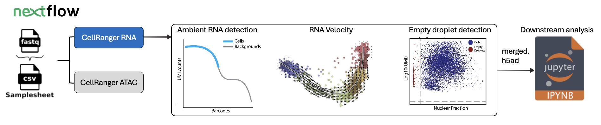

# Cellranger single cell RNA and ATAC Nextflow pipeline

The pipeline performs automated data (fastq) processing using samplesheet of the file locations.

<b>Table of content</b>

- [Prerequisite](#prerequisite)
- [Running the pipeline](#running-the-pipeline)
    - [Step-1: Generate the config file](#step1)
    - [Step-2: Running cellranger pipeline](#step2)
    - [Step-3: Interpreting results](#step3)
- [Other useful scripts](#utilities)

## Directory structure
    .
    ├── modules            # script for nextflow module
    ├── examples           # Currently contain template for downstream analysis
    ├── bin                # contains executable for the nextflow pipeline
    ├── scripts            # utility scripts
    └── README.md

## Running the pipeline

### Step-1: Generate the config file 
Directory: `scripts`

